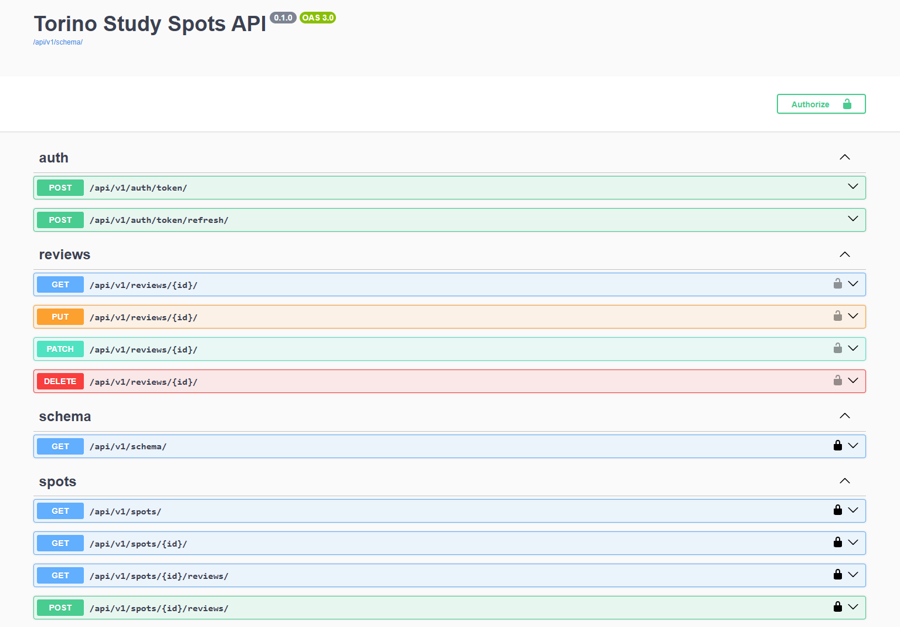
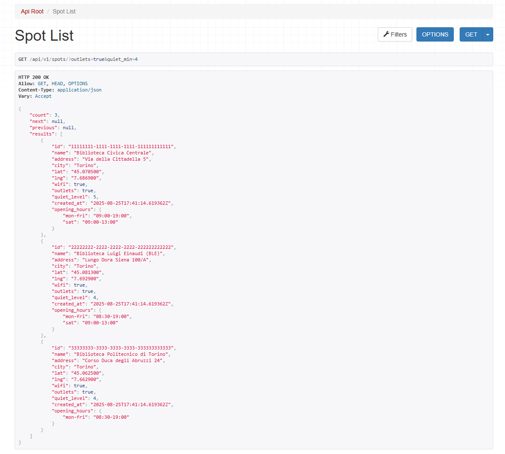
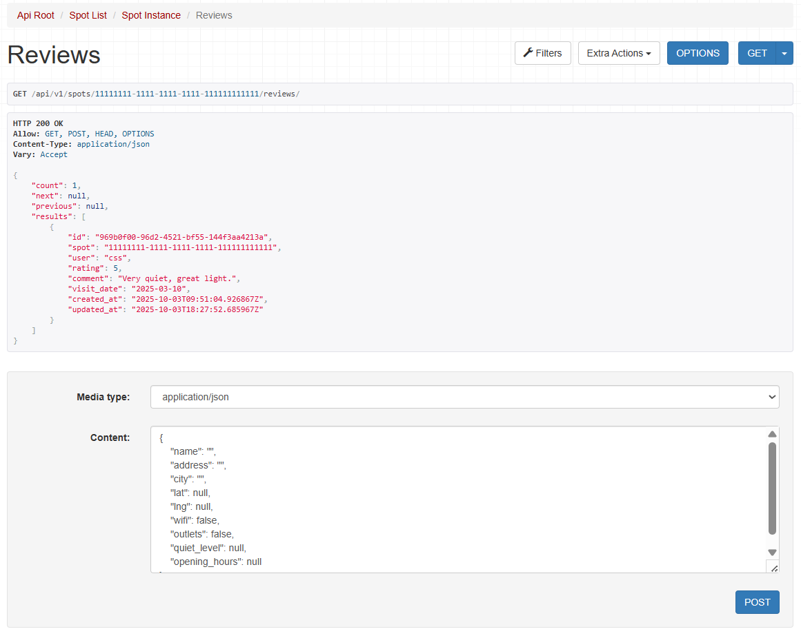
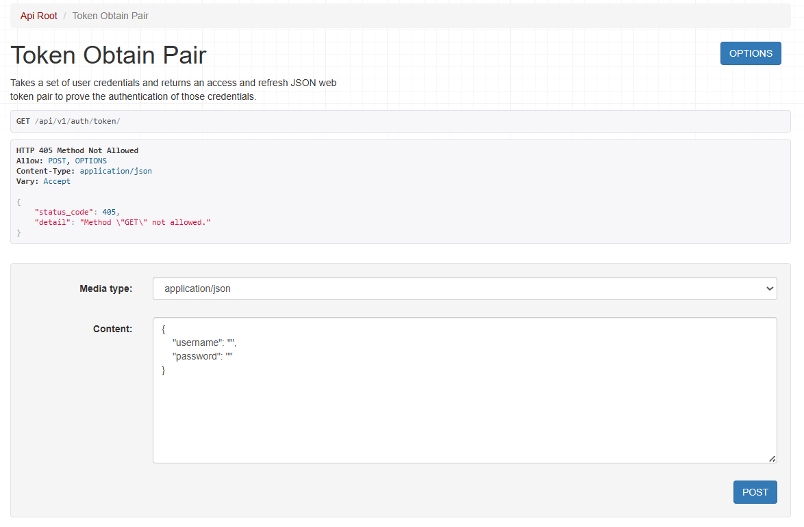

# 🗺️ Torino Study Spots API

Public REST API for discovering and reviewing study spots in Torino.

Built with **Django REST Framework**, featuring filters, reviews, throttling, and Swagger docs.

---

## ✨ Features

- 🏫 Spots list/detail with **search**, **filters** (`wifi`, `outlets`, `quiet_min`), **ordering**, and **pagination**
- ⭐ Reviews with **JWT-protected upsert**, and owner-only edit/delete
- ⏱️ **Throttling** (anonymous, user, and scoped per action)
- 📘 **OpenAPI/Swagger** documentation (`/api/v1/docs/`)
- ⚙️ **Consistent JSON errors** and **/health** endpoint
- 🐳 Docker-ready (dev & production)
- ✅ Simple demo data seeding with `python manage.py seed_demo`

---

## ⚙️ Quickstart (Local Development)

```bash
python -m venv .venv && source .venv/bin/activate
pip install -r requirements.txt
export DJANGO_SETTINGS_MODULE=core.settings_dev
python manage.py migrate
python manage.py seed_demo   # or: python manage.py loaddata spots
python manage.py runserver
# http://127.0.0.1:8000/api/v1/spots/
# http://127.0.0.1:8000/api/v1/docs/
```

---

### 🌐 Access

- API root → [http://127.0.0.1:8000/api/v1/spots/](http://127.0.0.1:8000/api/v1/spots/)
- Swagger docs → [http://127.0.0.1:8000/api/v1/docs/](http://127.0.0.1:8000/api/v1/docs/)
- Health check → [http://127.0.0.1:8000/health/](http://127.0.0.1:8000/health/)

---

## 🐳 Docker (Dev Mode)

```bash
docker compose up --build
```

Runs the app on [http://localhost:8000](http://localhost:8000) using SQLite.

---

## 🔑 Authentication

Obtain a JWT access token:

```bash
POST /api/v1/auth/token/
{
  "username": "<your_username>",
  "password": "<your_password>"
}
```

Use the token in authorized requests:

```
Authorization: Bearer <access_token>
```

---

## 🔍 Example API Usage

```bash
GET /api/v1/spots/?wifi=true&quiet_min=4&ordering=-avg_rating
```

---

## 🚀 Deployment (Render / Railway)

**Dockerfile:** `docker/prod.Dockerfile`

Environment variables required for production:

```
DJANGO_SETTINGS_MODULE=core.settings_prod
SECRET_KEY=<random-secure-string>
ALLOWED_HOSTS=<your-app-subdomain>.onrender.com
DATABASE_URL=<Postgres URL>    # optional, SQLite fallback
CORS_ALLOW_ALL=true            # for demo
```

---

## 🧪 Tests

```bash
pytest
```

---

## 🧱 Project Structure

```
study-spots-api/
├── core/
│   ├── settings_dev.py
│   ├── settings_prod.py
│   ├── exceptions.py
│   ├── urls.py
│   └── wsgi.py
├── spots/
│   ├── api_views.py
│   ├── api_serializers.py
│   ├── api_filters.py
│   ├── models.py
│   ├── tests/
│   │    ├── test_spots_api.py
│   │    ├── test_reviews_api.py
│   │    └── test_throttling_and_errors.py
│   └── management/commands/seed_demo.py
├── docker/
│   ├── web.Dockerfile
│   └── prod.Dockerfile
├── docker-compose.yml
├── requirements.txt
├── pytest.ini
└── README.md
```

---

## 🧩 Example Screenshot (Swagger UI)

Here are some preview images of the API in action:

**Swagger UI**


**Spot List with Filters**


**Reviews for a Spot**


**JWT Token Obtain**


---

## 🏁 Summary

✅ **Development:** `core.settings_dev` — runs with SQLite  
🐳 **Docker:** `docker-compose up --build` — portable local server  
🚀 **Production:** `core.settings_prod` — PostgreSQL + Gunicorn  
📘 **Docs:** available at `/api/v1/docs/`
